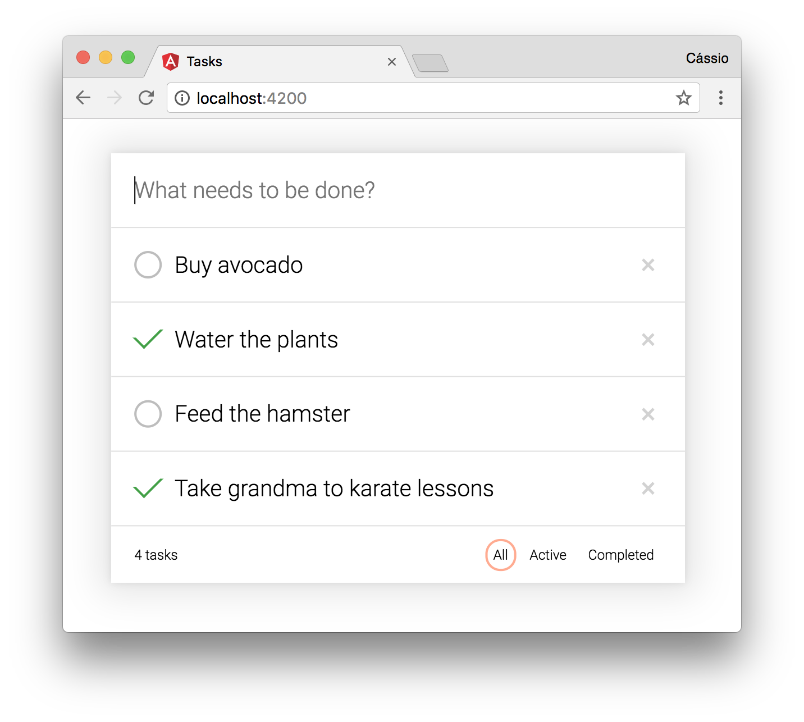

# Tasks

This application written in **Angular** and **TypeScript** intends to be a client application for the [`tasks-springboot-jersey`][tasks server project] project:

## Angular CLI

This project was generated with [Angular CLI](https://github.com/angular/angular-cli) and the following commands are available:

### Development server

Run `ng serve` for a dev server. Navigate to `http://localhost:4200/`. The app will automatically reload if you change any of the source files.

### Code scaffolding

Run `ng generate component component-name` to generate a new component. You can also use `ng generate directive|pipe|service|class|module`.

### Build

Run `ng build` to build the project. The build artifacts will be stored in the `dist/` directory. Use the `-prod` flag for a production build.

### Running unit tests

Run `ng test` to execute the unit tests via [Karma](https://karma-runner.github.io).

### Running end-to-end tests

Run `ng e2e` to execute the end-to-end tests via [Protractor](http://www.protractortest.org/).
Before running the tests make sure you are serving the app via `ng serve`.

[tasks server project]: https://github.com/cassiomolin/tasks-springboot-jersey
